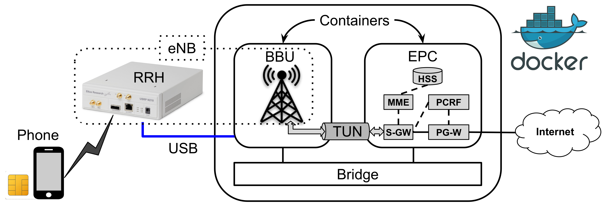
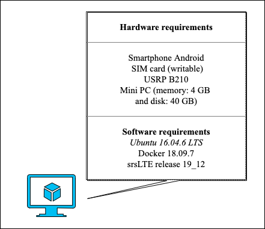
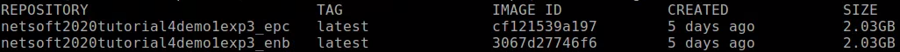
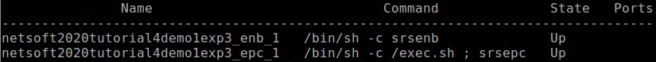
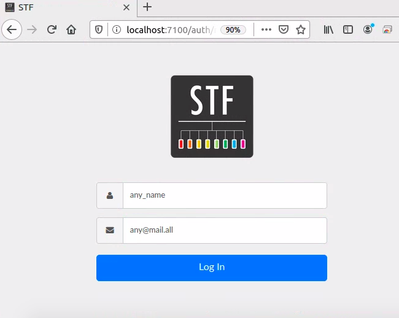
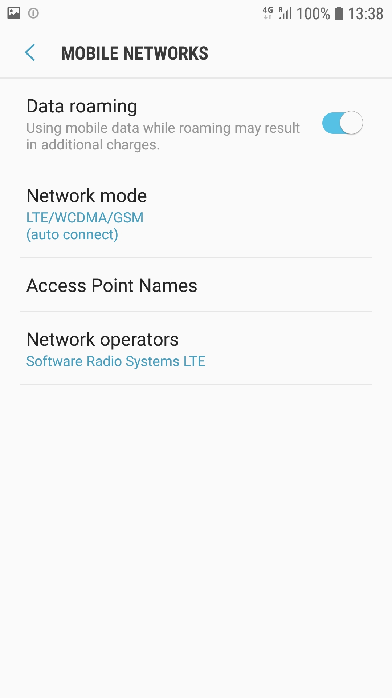
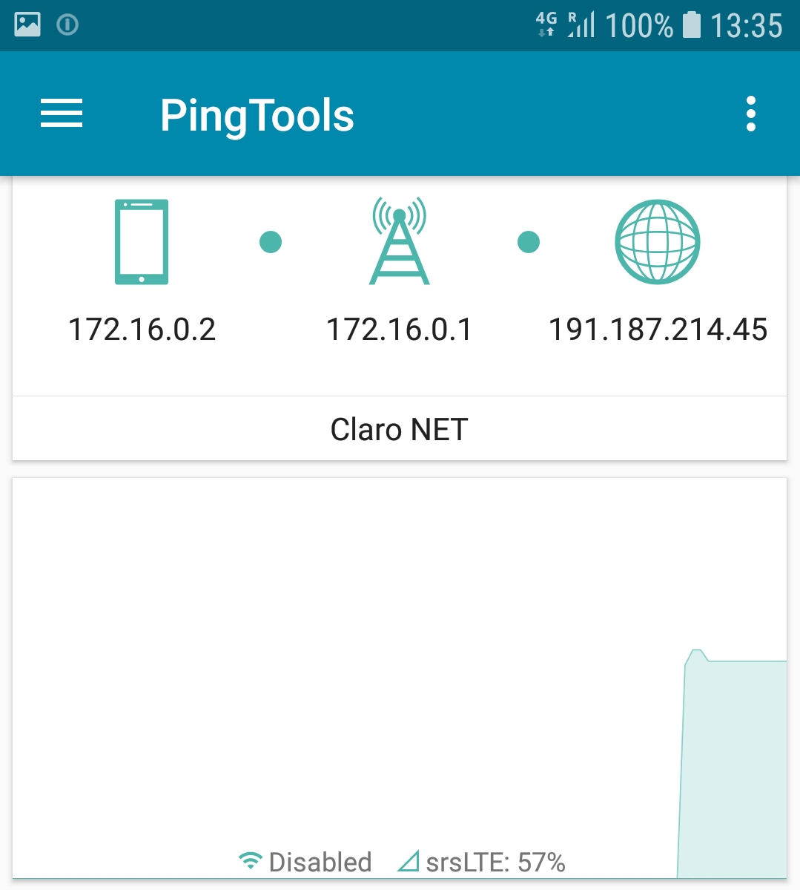
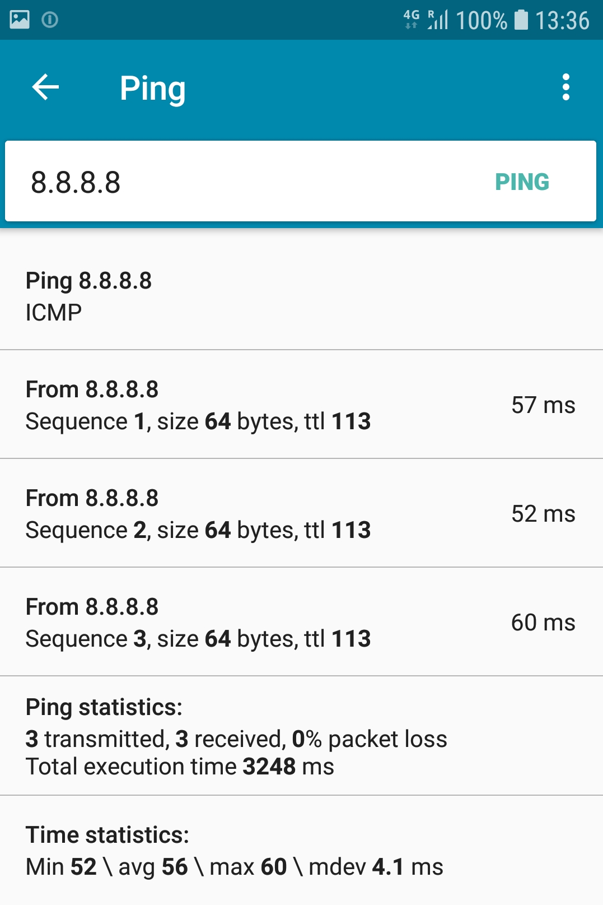

# NetSoft2020-Tutorial4-Demo1-Exp3

This project aims to provide a set of tools to deploy a mobile network based on the [Software Radio Systems LTE](https://www.srslte.com/), as illustrated by the following image.
<p align="center">
     
</p>

In this experiment, the elements of [Software Radio Systems LTE](https://github.com/srsLTE/srsLTE) compose of RAN and core of the 4G system. This experiment's main goal is to demonstrate a connection between UE in hardware (conventional cell phone), RAN in hardware (SDR - Software-Defined Radio) and software, and EPC core implemented in software.

The minimum hardware requirement and software to run this experiment is shown in the image below.
<p align="center">
     
</p>
For this experiment, we assume that the machine has full access to the Internet.

# 1 - Installation tools
We need two tools to run this experiment, _Git_ and _Docker_

To install _Git_, run the following command:
```
$ sudo apt-get install git-all
```

To install _Docker_, run the following commands:
```
$ sudo apt-get update
$ sudo apt-get install docker-ce docker-ce-cli containerd.io
```

 After, we can clone the **NetSoft2020-Tutorial4-Demo1-Exp3 project**:
```
$ git clone https://github.com/LABORA-INF-UFG/NetSoft2020-Tutorial4-Demo1-Exp3.git
```

# 2 - Build the images and running the containers

To build the eNB and EPC images and to run the containers, use the following command:  
```
$ sudo docker-compose up -d
```

We can check if the images are up:
```
$ sudo docker image ls
```
The output should be similar to the following:
<p align="center">
     
</p>

We can check if the containers are up:
```
$ sudo docker-compose ps
```
The output should be similar to the following:
<p align="center">
     
</p>

Done! The software is successfully installed.

# 3 - Show the experiment

We use the [openSTF](https://openstf.io/) tool to access the smartphone remotely.
This software is available at http://localhost:7100, as is shown in the image below.
<p align="center">
     
</p>

We can see the smartphone connected in the network called Software Radio Systems LTE available. 
<p align="center">
     
</p>

We use the [PingTools Network Utilities](https://play.google.com/store/apps/details?id=ua.com.streamsoft.pingtools&hl=pt_BR) tool available at GooglePlay to test the connectivity of the network.
<p align="center">
     
     
</p>

# 4 - Additional comments

In this experimentation, the SIM card used is of [sysmocom](https://www.sysmocom.de/index.html) with an Android Samsung Galaxy S7 SM-G930F.

The UE's information stored in HSS is available in the user_db.csv file. In this experiment, we use the values below:
```
sim0,mil,901700000028080,724d0f31f2259622700437430b7b5c6e,opc,1140620b2805d84b44643bfcfbe6218c,8080,00000028155b,7,dynamic
```
SDR is an [Ettus B210](https://www.ettus.com/) with four antennas connected via USB in the mini PC.  

