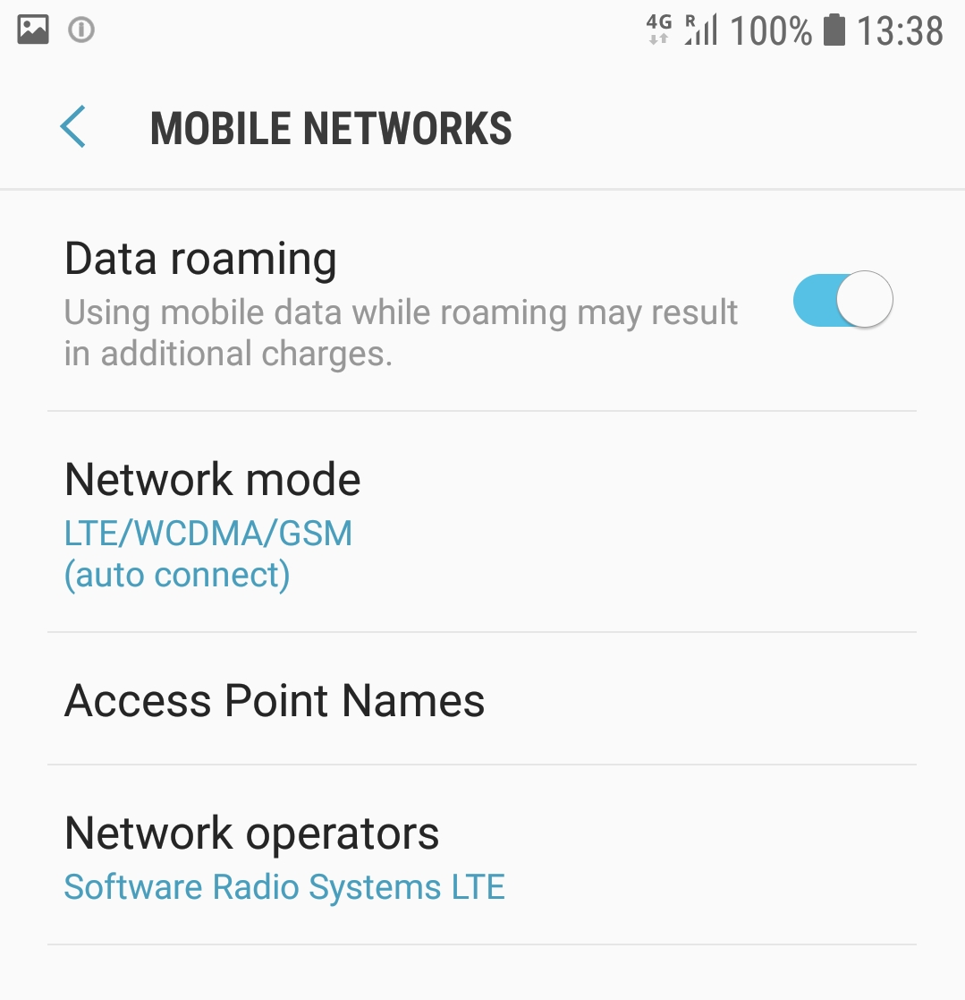

# NetSoft2020-Tutorial4-Demo1-Exp3

This project aims to provide a set of tools through which it is possible to deploy the mobile network that makes up the [Software Radio Systems LTE](https://www.srslte.com/), as illustrated by the following image.
<p align="center">
     
</p>

In this demo, the elements of [Software Radio Systems LTE](https://github.com/srsLTE/srsLTE) compose of RAN and core of 4G. The main goal of this experiment is to demonstrate a connection between UE in hardware (conventional cell phone), RAN in hardware (SDR - Software-Defined Radio) and software, and EPC core implemented in software.

The minimum hardware requirement and software to run this experiment is shown in the figure below.
<p align="center">
     
</p>
For this experiment, we assume that the machine have full access to the internet.

# 1 - Installation tools
We need two tools to run this experiment, _Git_ and _Docker_

To install _Git_ run the following command:
```
$ sudo apt-get install git-all
```

To install _Docker_ run the following commands:
```
$ sudo apt-get update
$ sudo apt-get install docker-ce docker-ce-cli containerd.io
```

 After, we can clone the **NetSoft2020-Tutorial4-Demo1-Exp3 project**:
```
$ git clone https://github.com/LABORA-INF-UFG/NetSoft2020-Tutorial4-Demo1-Exp3.git
```

# 2 - Build the images and running the containers

To build the eNB and EPC images and running the containers use the follow command: 
```
$ sudo docker-compose up -d
```

You can check if the images are up:
```
$ sudo docker image ls
```
The output should be similar to the following:
<p align="center">
     
</p>

You can check if the containers are up:
```
$ sudo docker-compose ps
```
The output should be similar to the following:
<p align="center">
     
</p>

Done! The software is successfully installed.

# 3 - Show the experiment

We use the [openSTF](https://openstf.io/) tool to access the smartphone remotely.
This software is available at http://localhost:7100, as is shown in the figure below.
<p align="center">
     
</p>

We can see the smartphone connected in the network called Software Radio Systems LTE available. 
<p align="center">
     
</p>

We use the [PingTools Network Utilities](https://play.google.com/store/apps/details?id=ua.com.streamsoft.pingtools&hl=pt_BR) available at GooglePlay to test the connectivity of the network.
<p align="center">
     
     
</p>


